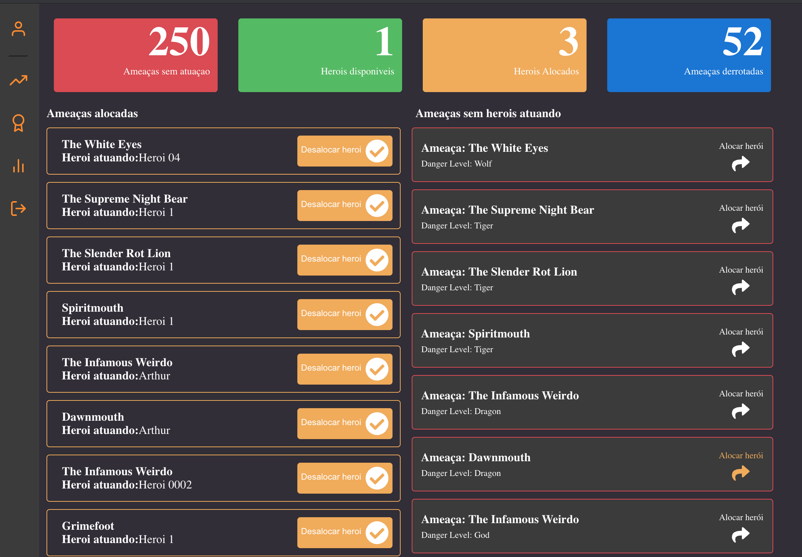
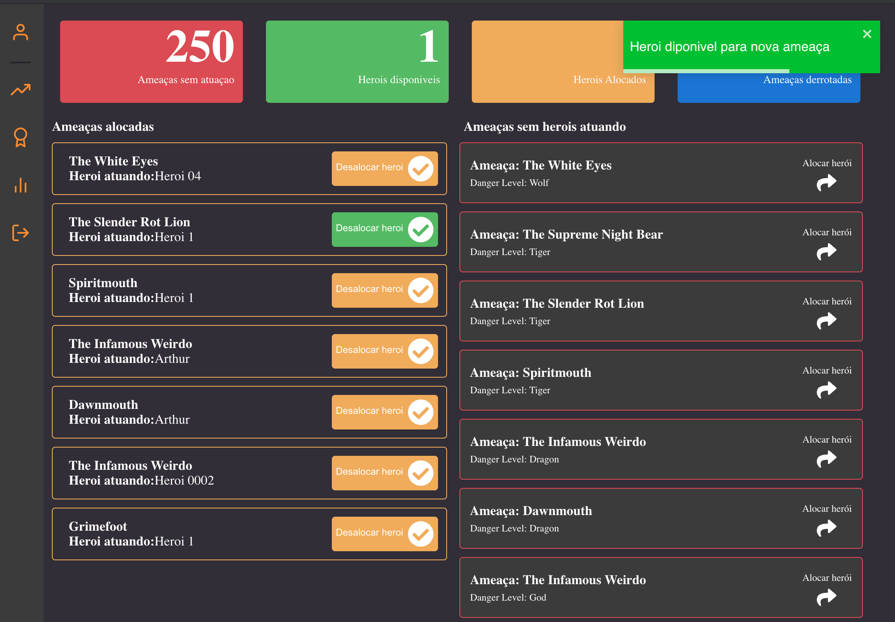
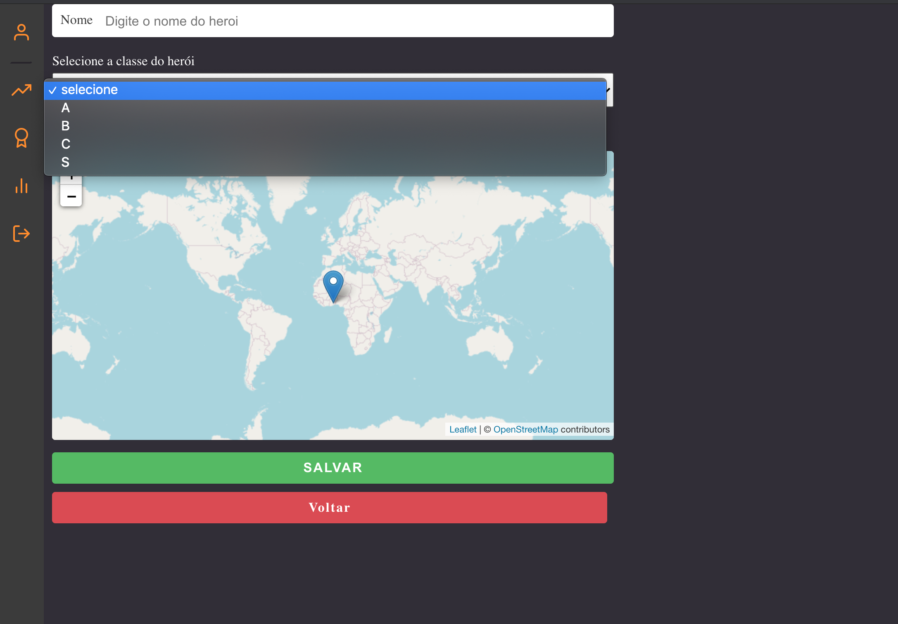
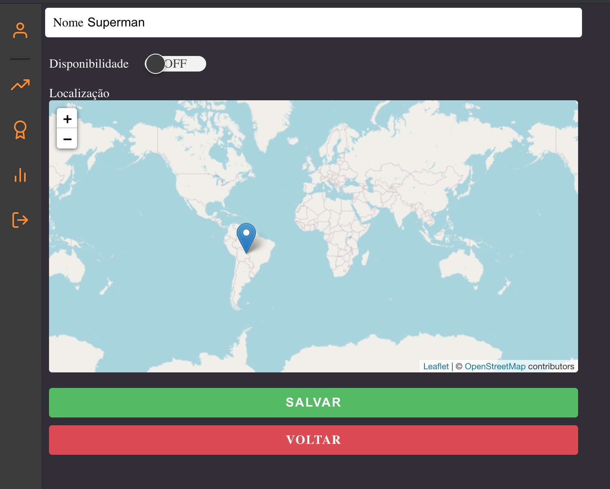
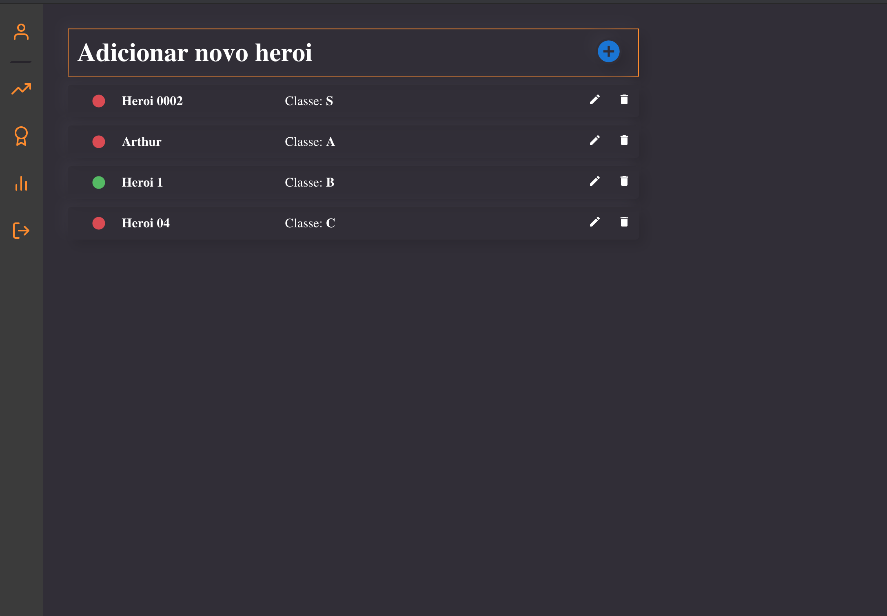

<h1 align="center">
    
</h1>
<h1 align="center">IHeros</h1>

  

  

  

  <a href="#rocket-technologias">Technologias utilizadas</a>&nbsp;&nbsp;&nbsp;|&nbsp;&nbsp;&nbsp;
  <a href="#-projeto">Projeto</a>&nbsp;&nbsp;&nbsp;|&nbsp;&nbsp;&nbsp;
  <a href="#Screenshots">Screenshots</a>&nbsp;&nbsp;&nbsp;|&nbsp;&nbsp;&nbsp;
  <a href="#-how-can-i-run-it">Como executar?</a>&nbsp;&nbsp;&nbsp;|&nbsp;&nbsp;&nbsp;
  <a href="#memo-license">License</a>

 

## :rocket: Technologias

This project uses these technologies:

- [React](https://reactjs.org)
- [NodeJs]()
- [Express]()
- [TypeScript]()
- [Jest]()
- [TypeOrm]()
- [Tsrynge]()
- [Postgres]()
- [Redis]()
- [JWT]()
- [Axios]()
- [Styled Components]()
- [Eslint]()
- [React Icons]()
- [Socket.IO]()
- [Leaflet]()

## 💻 Projeto

O Projeto consistem em uma aplição backend e frontend e foi desenvolvido baseado no seguinte cenário:

> Você está no ano de 3150 e está a frente do setor de tecnologia responsável pelo desenvolvimento do sistema de gerenciamento de distribuição de Heros para combater ameaças. O sistema deve monitorar o sistema de alertas de ameças provido pela ONU e alocar os herois para cada nova ameaça existente no globo terrestre.

Para atender os requisítos da proposta foi utilizado a lib [socket.io](https://socket.io/) para consumir as informações vindas do socket e adicionamos o serviço filas utilizando a lib [Bull](https://github.com/OptimalBits/bull) junto com o [Redis](https://redis.io/), cujo serviço é de ao receber a notificação localizar o herois mais proximo através da localização geografica, utilizando a formula de [Haversine](https://pt.wikipedia.org/wiki/F%C3%B3rmula_de_Haversine#:~:text=A%20f%C3%B3rmula%20de%20Haversine%20%C3%A9,de%20suas%20latitudes%20e%20longitudes.) para o calculo em km . No frontend adicionamos o tela de login com autenticação [JWT](https://jwt.io/) e a [Context Api](https://pt-br.reactjs.org/docs/context.html) para armazenamento do token. em nosso layout foi desenvolvido com o auxilio da lib [styled components](https://pt-br.reactjs.org/docs/context.html) para a estilização e a lib [Leaftlet](https://leafletjs.com/) para o uso do Mapa.

## ✓ Prerequisite

- Postgres
- Redis

## 👨‍💻 Como executar?

`git clone https://github.com/abauruel/challenges.git`

### Backend

renomeio .env.example para .env para configurar as variaveis de ambiente 
`cd backend && yarn && yarn typeorm migration:run && yarn dev:server`

### FrontEnd

`cd frontend && yarn && yarn start`

usuario: admin@iheros.com
password: 123456

## Screenshots

## :memo: License

This project uses the MIT license. Read [LICENSE](LICENSE.md) for details.

---

Made with ♥ by Alex Claude :wave:
